<div align="center">

# MeetSpot


### AI Agent for Multi-Person Meeting Point Recommendations

*Not just a search tool. An autonomous agent that decides the fairest meeting point for everyone.*

[](https://meetspot-irq2.onrender.com)
[](https://www.bilibili.com/video/BV1aUK7zNEvo/)

[](https://opensource.org/licenses/MIT)
[](https://www.python.org/downloads/)
[](https://fastapi.tiangolo.com/)
[](https://github.com/calderbuild/MeetSpot/actions)

**Qloo Agentic Hackathon 2026:** [group taste fairness](#group-taste-fairness-with-qloo) · [try the New York demo group](https://meetspot-irq2.onrender.com/public/meetspot_finder.html?lang=en)

**RevenueCat Shipaton 2026:** [demo video (1:48)](https://youtu.be/_y6peCnn-8w) · [Devpost](https://devpost.com/software/meetspot-for-macos) · [macOS app + RevenueCat](#macos-app--revenuecat)

[English](README.md) | [简体中文](README_ZH.md)

</div>

---

## Why MeetSpot?

Most location tools return results near *you*. MeetSpot calculates the **geographic center** of all participants and returns AI-ranked venues that minimize everyone's travel time.

| Traditional Tools | MeetSpot |
|-------------------|----------|
| Search near your location | Calculate fair center for all |
| Keyword-based ranking | AI-powered multi-factor scoring |
| Static results | Adaptive dual-mode routing |
| No reasoning | Explainable AI with chain-of-thought |

<div align="center">
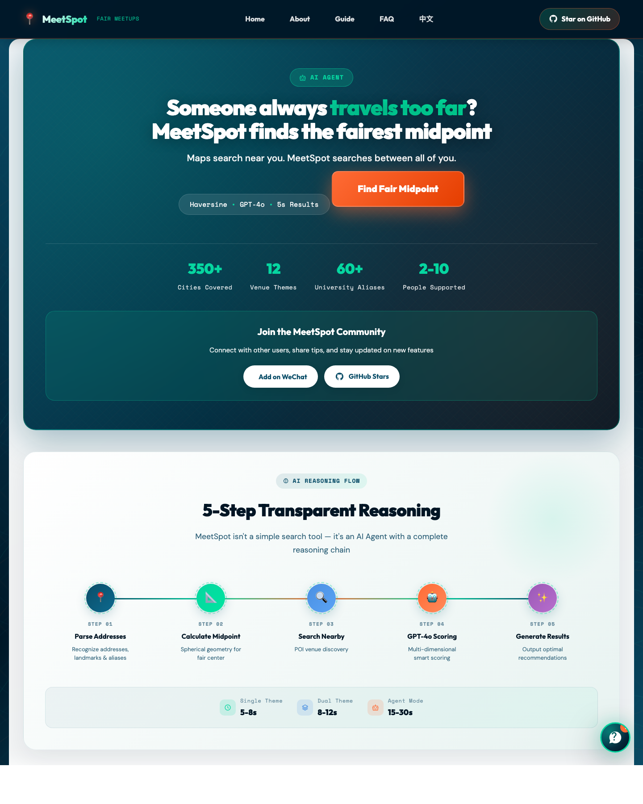
</div>

---

## Group Taste Fairness with Qloo

Picking a place for a group usually means somebody gets dragged somewhere they would never choose. MeetSpot already finds a fair *location* for everyone; since 2026-09-30 it also finds a fair *place*, using each person's own taste.

Each person lists a few things they love (artists, movies, shows, brands, books). MeetSpot resolves them to Qloo entities, has Qloo score the same set of nearby venues once **per person**, and ranks venues by the **least-satisfied person** (maximin over each person's percentile), not the group average. A venue that two people love and the third would hate is left out, and the page says who would have been unhappy and why.

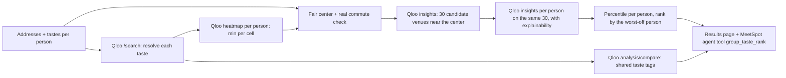

**How Qloo is used**

| Qloo capability | What MeetSpot does with it |
|---|---|
| `/search` | Turns "Taylor Swift, Barbie" into entities and shows each person what their taste was recognized as |
| `/v2/insights` place + `filter.location` + venue tag | Candidate restaurants, cafes or bars around the fair center |
| `filter.results.entities` + `signal.interests.entities` | Scores the *same* candidates once per person, so people can be compared |
| `feature.explainability` | "Person 1 matches via Barbie": the reason comes from Qloo's data, not from an LLM |
| `filter.type=urn:heatmap` | One taste heatmap per person; the cell-wise minimum picks between commute-fair centers and shades the map |
| `/v2/analysis/compare` | "What you have in common" for the group |
| `filter.price_level.max` | Budget filter mapped from the existing price range field |

**What the agent does.** `MeetSpotAgent` (a ReAct agent over DeepSeek) gets a new tool, `group_taste_rank`. Given a group with tastes it geocodes everyone, computes the fair center, calls the tool, and explains its pick person by person using only what the tools returned. On the results page, **Ask the agent** runs it on the same group and shows each tool call it made.

**What changed for the hackathon** (all after 2026-09-30): the Qloo client (`app/tool/qloo_client.py`), per-person maximin ranking and taste heatmap in the recommender, the agent tool and English agent mode, per-person taste inputs with a New York demo group, the taste card / fit bars / left-out venues on the results page, and the Ask the agent card. Requests without tastes behave exactly as before.

**Try it:** open the [finder](https://meetspot-irq2.onrender.com/public/meetspot_finder.html?lang=en), click **Try a demo group in New York**, then **Find Fair Midpoint**. Taste searches are not counted against the free daily limit during judging.

---

## Agent Architecture

MeetSpot is an **AI Agent** - it makes autonomous decisions based on request complexity, not just executes searches.

```
                              User Request
                                   │
                    ┌──────────────┴──────────────┐
                    │      Complexity Router      │
                    │    (Autonomous Decision)    │
                    └──────────────┬──────────────┘
                                   │
              ┌────────────────────┼────────────────────┐
              │                    │                    │
              ▼                    │                    ▼
    ┌─────────────────┐            │          ┌─────────────────┐
    │    Rule Mode    │            │          │   Agent Mode    │
    │   (2-4 sec)     │            │          │   (8-15 sec)    │
    │  Deterministic  │            │          │  LLM-Enhanced   │
    └────────┬────────┘            │          └────────┬────────┘
             │                     │                   │
             └─────────────────────┼───────────────────┘
                                   │
                    ┌──────────────┴──────────────┐
                    │    5-Step Processing        │
                    │        Pipeline             │
                    └──────────────┬──────────────┘
                                   │
        ┌──────────┬──────────┬────┴────┬──────────┬──────────┐
        │          │          │         │          │          │
        ▼          ▼          ▼         ▼          ▼          ▼
    Geocode    Center     POI      Ranking     HTML      Result
              Calc      Search               Gen
```

### Intelligent Mode Selection

The Agent autonomously decides which processing mode to use:

| Factor | Score | Example |
|--------|-------|---------|
| Location count | +10/location | 4 locations = 40 pts |
| Complex keywords | +15 | "quiet business cafe with private rooms" |
| Special requirements | +10 | "parking, wheelchair accessible, WiFi" |

- **Score < 40**: Rule Mode (fast, deterministic, pattern-matched)
- **Score >= 40**: Agent Mode (LLM reasoning, semantic understanding)

### Agent Mode Scoring

```
Final Score = Rule Score × 0.4 + LLM Score × 0.6
```

The LLM analyzes semantic fit between venues and requirements, then blends with rule-based scoring. Results include **Explainable AI** visualization showing the agent's reasoning process.

### 5-Step Pipeline

| Step | Function | Details |
|------|----------|---------|
| **Geocode** | Address → Coordinates | 60+ smart mappings (universities, landmarks) |
| **Center Calc** | Fair point calculation | Spherical geometry for accuracy |
| **POI Search** | Venue discovery | Concurrent async search, auto-fallback |
| **Ranking** | Multi-factor scoring | Base(30) + Popularity(20) + Distance(25) + Scenario(15) + Requirements(10) |
| **HTML Gen** | Interactive map | Amap JS API integration |

---

## Quick Start

```bash
# Clone and install
git clone https://github.com/calderbuild/MeetSpot.git && cd MeetSpot
pip install -r requirements.txt

# Configure (get key from https://lbs.amap.com/)
cp config/config.toml.example config/config.toml
# Edit config.toml and add your AMAP_API_KEY

# Run
python web_server.py
```

Open http://127.0.0.1:8000

---

## macOS App + RevenueCat

MeetSpot also ships as a macOS desktop app (Electron, in `desktop/`). Each device gets one free search a day. In the macOS app, a **MeetSpot Pro** purchase through RevenueCat removes that limit.

<div align="center">
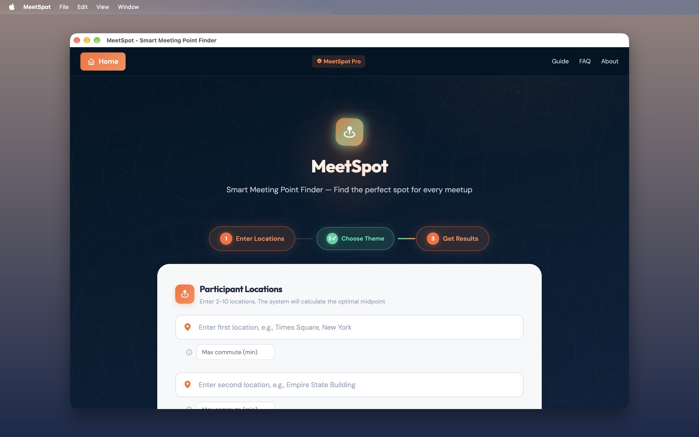
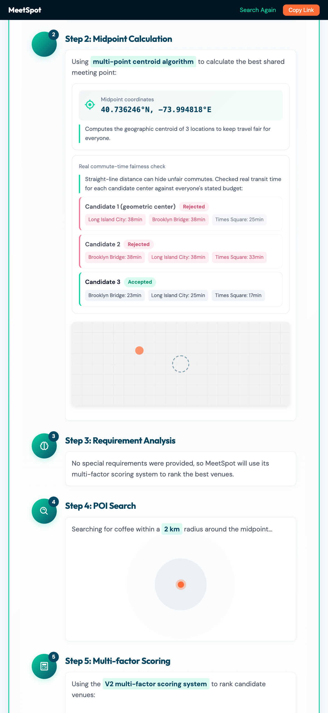
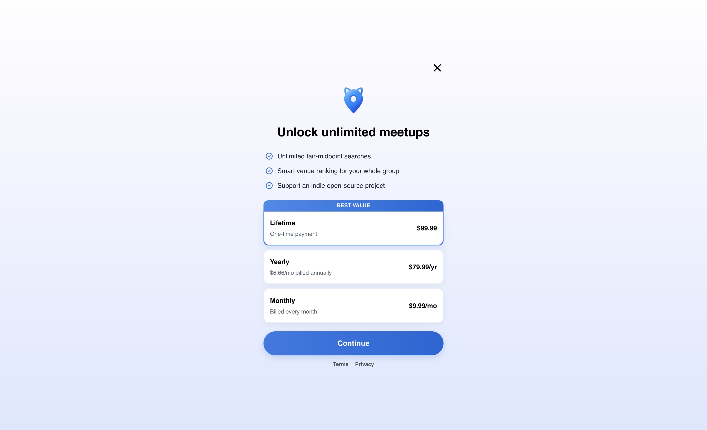
</div>

How the purchase flow works:

1. The app keeps an anonymous RevenueCat app user id in localStorage and sends it as `X-RC-App-User-Id` with every search.
2. When the free search is used up, the server answers `need_payment`. The app then loads [`@revenuecat/purchases-js`](https://www.npmjs.com/package/@revenuecat/purchases-js) and calls `presentPaywall()` for the current offering.
3. After the purchase, the app reruns the search. The server never trusts the client: it calls RevenueCat REST `GET /v1/subscribers/{id}` with the secret key and skips the quota only when the `meetspot_pro` entitlement is active (`app/payment/revenuecat.py`). If that lookup fails, the request falls back to the normal quota and is never granted.
4. On launch the app calls `getCustomerInfo()`. An active `meetspot_pro` shows a **MeetSpot Pro** badge; otherwise a **Go Pro** button opens the same paywall. The badge is display only, and the server still decides on every search.

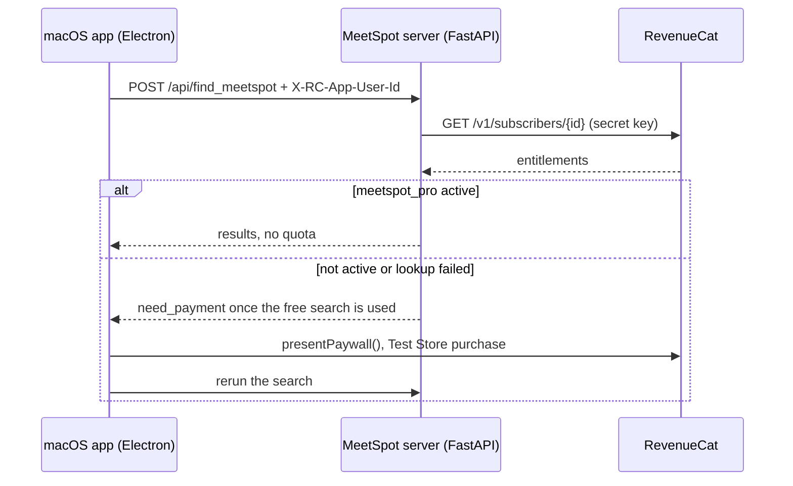

| File | What it does |
|------|--------------|
| `desktop/main.js`, `desktop/preload.js` | Electron shell; the preload sets `window.MEETSPOT_PLATFORM = "macos"` |
| `public/meetspot_finder.html` | App user id, Web SDK paywall, automatic retry, Pro badge |
| `app/payment/revenuecat.py` | Server-side entitlement check; any failure falls back to the free limit |
| `api/index.py` | Quota gate in `find_meetspot`, `/api/config/revenuecat` |
| `tests/test_revenuecat.py` | 12 tests against a mocked RevenueCat |

Run it locally:

```bash
# 1. Server (needs AMAP_API_KEY / GOOGLE_MAPS_API_KEY + LLM key as in Quick Start)
export REVENUECAT_PUBLIC_KEY=test_xxx      # Test Store public API key
export REVENUECAT_SECRET_KEY=sk_xxx        # v1 secret API key (server only)
uvicorn api.index:app

# 2. Desktop app (second terminal)
cd desktop && npm install && npm start

# Or build MeetSpot.app with its icon (ad-hoc signed, written to desktop/dist/)
cd desktop && npm run package
```

RevenueCat setup: create a project (it comes with a Test Store), an entitlement `meetspot_pro`, a Test Store product attached to it (a one-time purchase, since Test Store subscriptions expire after about 25 minutes), add it to the default offering, and configure a paywall on that offering.

To make a test purchase, run one search (free), then run a second one. The paywall appears. Pick the product and choose the successful-purchase option in the Test Store dialog. The search reruns and goes through, and the customer shows `meetspot_pro` active in the RevenueCat dashboard.

Known limitation: the app user id is anonymous and device-local. Anyone who learns that id could reuse its entitlement. The production fix is to tie the id to a MeetSpot account (`app/auth`). Without the header or the RevenueCat keys, MeetSpot behaves exactly as before, and the web build keeps its existing payment flow.

---

## API Reference

### Main Endpoint

`POST /api/find_meetspot`

```json
{
  "locations": ["Peking University", "Tsinghua University", "Renmin University"],
  "keywords": "cafe restaurant",
  "user_requirements": "parking, quiet environment"
}
```

Optional `tastes` (one string per location, English path only) turns on Qloo group taste ranking:

```json
{
  "locations": ["Times Square, New York", "Union Square, New York", "Grand Central Terminal, New York"],
  "keywords": "restaurant",
  "tastes": ["Taylor Swift, Barbie", "Metallica, John Wick", "Bad Bunny, Trader Joe's"],
  "language": "en"
}
```

**Response:**
```json
{
  "success": true,
  "html_url": "/workspace/js_src/place_recommendation_20260929153459_1f2dace8.html",
  "locations_count": 2,
  "processing_time": 5.2,
  "mode": "rule_llm",
  "message": "Recommendation generated successfully"
}
```

### Other Endpoints

| Endpoint | Method | Description |
|----------|--------|-------------|
| `/api/find_meetspot_agent` | POST | Force Agent Mode (LLM reasoning); with `tastes` it calls Qloo through `group_taste_rank` and returns `taste_ranking` + `tool_trace` |
| `/api/ai_chat` | POST | AI customer service chat |
| `/health` | GET | System health check |
| `/docs` | GET | Interactive API documentation |

---

## Screenshots

<table>
<tr>
<td width="50%">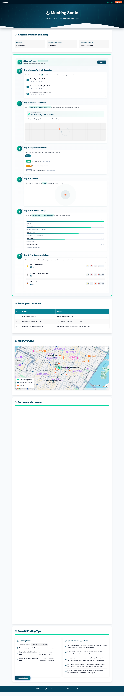<p align="center"><b>Agent Chain-of-Thought</b></p></td>
<td width="50%">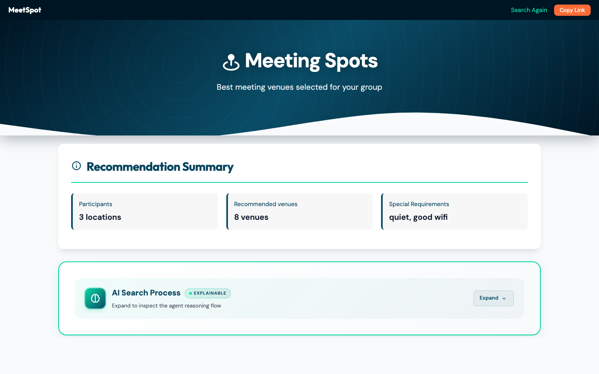<p align="center"><b>Interactive Map View</b></p></td>
</tr>
<tr>
<td width="50%">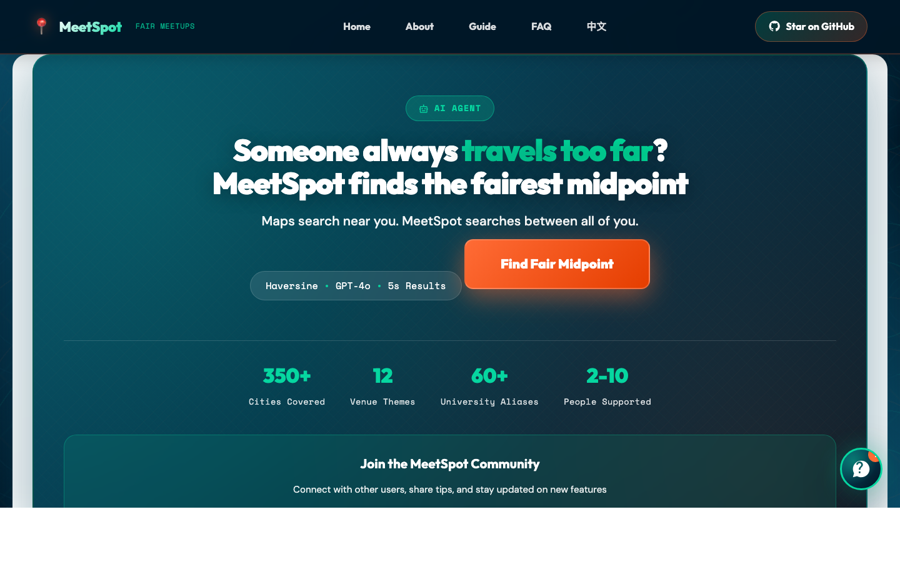<p align="center"><b>Homepage</b></p></td>
<td width="50%">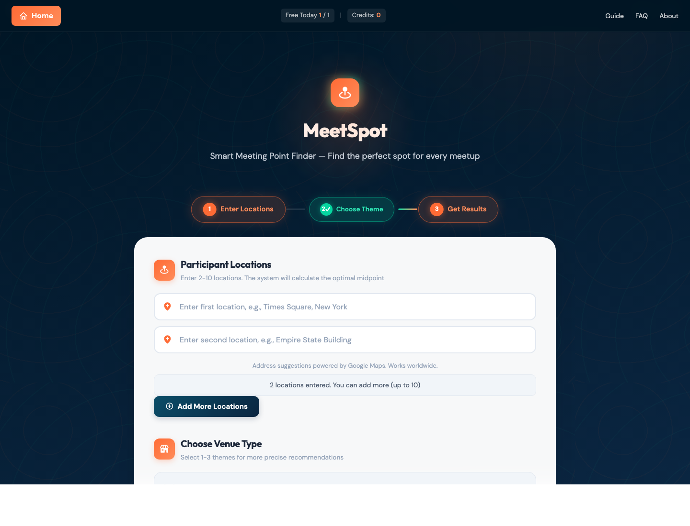<p align="center"><b>Meeting Point Finder</b></p></td>
</tr>
</table>

<details>
<summary><b>More Screenshots</b></summary>

<table>
<tr>
<td width="60%" align="center">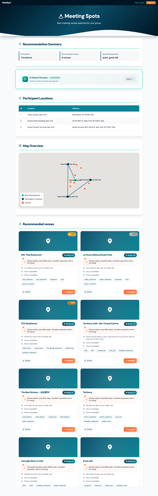<p align="center"><b>Full Results Page (NYC example)</b></p></td>
<td width="40%" align="center">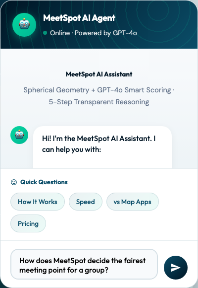<p align="center"><b>AI Assistant Chat</b></p></td>
</tr>
</table>

</details>

---

## Tech Stack

| Layer | Technologies |
|-------|--------------|
| **Backend** | FastAPI, Pydantic, aiohttp, SQLAlchemy 2.0, asyncio |
| **Frontend** | HTML5, CSS3, Vanilla JavaScript, Boxicons |
| **Maps** | Amap (Gaode) for China + Google Maps Platform for international (auto-routed by language) |
| **AI** | DeepSeek (default `deepseek-flash`) via OpenAI-compatible API |
| **Deploy** | Render, Railway, Docker, Vercel |

### Docker Quick Start

1. Copy the environment template and fill in your keys: `cp .env.example .env`
2. Build and run: `docker build -t meetspot . && docker run --env-file .env -p 8000:8000 meetspot`
3. Open http://localhost:8000 and check http://localhost:8000/health

---

## Project Structure

```
MeetSpot/
├── api/
│   └── index.py                 # FastAPI application entry
├── app/
│   ├── tool/
│   │   └── meetspot_recommender.py  # Core recommendation engine
│   ├── config.py                # Configuration management
│   └── design_tokens.py         # WCAG-compliant color system
├── templates/                   # Jinja2 templates
├── public/                      # Static assets
└── workspace/js_src/            # Generated result pages
```

---

## Development

```bash
# Development server with hot reload
uvicorn api.index:app --reload

# Run tests
pytest tests/ -v

# Code quality (same checks as CI)
ruff check . && flake8 . --select=E9,F63,F7,F82
```

---

## Contributing

Contributions are welcome! Please:

1. Fork the repository
2. Create a feature branch (`git checkout -b feature/amazing-feature`)
3. Commit your changes (`git commit -m 'Add amazing feature'`)
4. Push to the branch (`git push origin feature/amazing-feature`)
5. Open a Pull Request

---

## Contact

<table>
<tr>
<td>

**Email:** Johnrobertdestiny@gmail.com

**GitHub:** [Issues](https://github.com/calderbuild/MeetSpot/issues)

**Blog:** [calderbuild.github.io](https://calderbuild.github.io/)

</td>
<td align="center">


**Personal WeChat**

</td>
<td align="center">


**WeChat Group**

</td>
</tr>
</table>

---

## Acknowledgements

Special thanks to [AIGC Link](https://xhslink.com/m/80ngts127cA) for the promotions on XiaoHongShu.

---

## GOAI 2026 Roadmap

- Preliminary (by Aug 16): 500-word intro and a 12-page deck, positioned as a multi-person offline collaboration decision agent in local life services
- Semi-finals (Aug 25 - Sep 3): stability fixes, Agent loop upgrades (intent classification, tool traces, confidence and quality gates), enterprise meeting planning mode, and a benchmark suite
- Finals (Sep 22): live demo, explainable reasoning showcase, and open-source ecosystem narrative

---

## License

MIT License - see [LICENSE](LICENSE) for details.

---

<div align="center">

**If MeetSpot helps you, please give it a star!**

[](https://star-history.com/#calderbuild/MeetSpot&Date)

</div>
